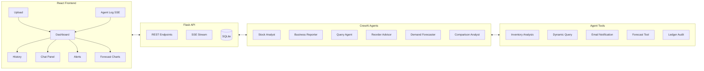

# Feature Expansion Roadmap — InventoryAIgent (20-Credit MCA Project)

> **Current state:** 2 agents (Stock Analyst → Business Reporter), sequential pipeline, upload Excel → get report. Works, but is a single-use-case demo.
>
> **Goal:** Turn this into a multi-module, production-grade agentic platform that screams *"I understand AI systems engineering"* to an evaluator.

---

## Evaluation Priorities (What Evaluators Actually Look For)

| Criterion | What Impresses | What Your Project Needs |
|---|---|---|
| **Depth** | Not just calling an API — showing reasoning, tool use, multi-step pipelines | ✅ Already good |
| **Breadth** | Multiple modules / use cases under one roof | ❌ Currently single module |
| **Real-world utility** | Solves a pain point SMEs actually face | ⚠️ Partial (stock alerts are useful but narrow) |
| **Technical sophistication** | RAG, multi-agent orchestration, hybrid AI+ML | ❌ Currently simple sequential |
| **UI/UX polish** | Dashboard, charts, live feedback — not just a file uploader | ❌ Current UI is minimal |
| **Viva talking points** | Explainable design choices, tradeoffs, failure handling | ⚠️ Needs more surface area |

---

## Recommended Features (Ranked by Impact ÷ Effort)

### 1. 📊 Interactive Dashboard with Charts (HIGH IMPACT · LOW EFFORT)

**The Problem:** Right now the user uploads a file and downloads a report — they never *see* the data inside your app. Evaluators will open the app and see a file uploader. That's underwhelming.

**The Feature:**
- After analysis completes, render the results *in the browser* as charts and tables
- Show: pie chart of stock health (out-of-stock vs low vs healthy), top 10 critical items bar chart, summary stats cards
- The backend returns the analysis data as JSON alongside the Excel report
- Frontend renders it with a charting library like **Recharts** (already React-compatible, zero config)

**Why It's Easy:**
- Your `tools.py` already computes `out_of_stock`, `low_stock`, `critical_stock` — just serialize those DataFrames as JSON
- Add one new endpoint: `GET /results/<report_id>` returning the JSON
- Frontend: 1 new component (`Dashboard.jsx`) using Recharts

**Academic Value:** Shows *multimodal output* — the same agent pipeline produces both a downloadable report AND a visual dashboard.

---

### 2. 💬 "Chat with Your Data" — Natural Language Querying (HIGH IMPACT · MEDIUM EFFORT)

**The Problem:** Business owners don't know pandas. They want to ask "Which product had zero stock last 3 months?" and get an answer.

**The Feature:**
- A chat interface in the frontend sidebar
- User types a question → sent to a new **Query Agent**
- The Query Agent uses Gemini to understand the question, writes a pandas query, executes it via a custom tool, and returns a natural language answer
- Example: *"What percentage of items are out of stock?"* → Agent runs `(out_of_stock.shape[0] / df.shape[0]) * 100` → *"23% of your items are currently out of stock."*

**Implementation Sketch:**
```
New Agent: Data Query Analyst
  └── Tool: DynamicQueryTool (takes a pandas expression string, runs it against the loaded DataFrame, returns result)
New Endpoint: POST /query { question: "..." }
New Component: ChatPanel.jsx (message list + input)
```

**Why It's Achievable:**
- CrewAI already supports tool-calling — you just add a new agent + tool
- The LLM (Gemini 2.5 Flash) is excellent at generating pandas code from natural language
- Simple chat UI is ~100 lines of JSX

**Academic Value:** This is a **RAG-lite** pattern. Shows the evaluator you understand *agentic tool use* (not just prompt→response) and *dynamic code generation*. Extremely strong viva talking point.

> [!TIP]
> Add a **"Suggested Questions"** section with 3-4 clickable example queries. This gives the evaluator instant things to try and prevents the "I don't know what to type" problem during demos.

---

### 3. 🔔 Smart Reorder Alerts with Email Notification (MEDIUM IMPACT · LOW EFFORT)

**The Problem:** The app tells you what's low — but doesn't *do* anything about it. Real inventory systems trigger reorder alerts.

**The Feature:**
- After analysis, a new **Alert Agent** reviews the critical/low-stock items
- It generates a prioritized reorder list with suggested quantities (based on simple heuristics like "reorder to 2× the low-stock threshold")
- Optionally sends an email summary via **SMTP** (Gmail app password — trivial to configure)
- Frontend shows an "Alerts" tab with a bell icon badge showing count of critical items

**Implementation Sketch:**
```
New Agent: Reorder Advisor
  └── Tool: EmailNotificationTool (sends HTML email via smtplib)
New sheet in Excel report: "Reorder Suggestions"
New Component: AlertsPanel.jsx
```

**Why It's Easy:**
- Python `smtplib` is built-in, 20 lines of code
- The agent logic is just: "For each low-stock item, suggest reorder quantity = threshold × 2"
- You already have the data from the analysis tool

**Academic Value:** Shows the system is **proactive, not reactive**. Demonstrates real-world automation beyond analysis → into *action*. Evaluators love seeing systems that *do* things.

---

### 4. 📈 Sales Trend Forecasting (HIGH IMPACT · MEDIUM EFFORT)

**The Problem:** Knowing current stock is reactive. Predicting *when* you'll run out is proactive.

**The Feature:**
- If the user uploads monthly stock data over time (or you maintain a history of uploads), a **Forecasting Agent** uses simple linear regression or Facebook Prophet to predict stock depletion dates
- Output: "Product X will run out in ~12 days at current consumption rate"
- Rendered as a line chart with projections in the dashboard

**Implementation Sketch:**
```
New Agent: Demand Forecaster
  └── Tool: ForecastTool (uses sklearn LinearRegression or Prophet)
New Endpoint: GET /forecast/<product_name>
New Component: ForecastChart.jsx
```

**Why It's Achievable (simpler than it sounds):**
- You can start with just `sklearn.linear_model.LinearRegression` on 2 columns: date vs closing_balance
- If user uploads data monthly, even 3-4 data points give a trend line
- Prophet is overkill but impressive for the viva — use it if time permits

**Academic Value:** **This is your strongest differentiator.** It merges **classical ML** (regression) with **generative AI** (the agent explains the prediction in plain English). Every evaluator will remember "the project that predicted stock depletion."

> [!IMPORTANT]
> Even with limited data, a simple trend line + agent explanation is 10× more impressive than no forecasting at all. Don't skip this because you think you need loads of historical data.

---

### 5. 📜 Analysis History & Comparison (MEDIUM IMPACT · LOW EFFORT)

**The Problem:** Currently, every upload is a one-shot — there's no memory. You can't compare this month's stock health vs last month's.

**The Feature:**
- Store each analysis run in a **SQLite database** (date, filename, summary stats, agent output)
- Add a "History" page in the frontend showing past analyses as a timeline
- Allow comparing two runs side-by-side: "Stock health improved — 5 fewer out-of-stock items vs last month"
- A **Comparison Agent** that takes two analysis snapshots and generates a natural language diff

**Implementation Sketch:**
```
New: db.py (SQLite with 1 table: analysis_runs)
New Agent: Comparison Analyst
New Endpoint: GET /history, GET /compare?run1=X&run2=Y
New Component: HistoryPage.jsx, ComparisonView.jsx
```

**Why It's Easy:**
- SQLite is built into Python, no setup
- The comparison agent just gets two JSON blobs and describes the delta
- Gives you a multi-page app (upload → dashboard → history → compare)

**Academic Value:** Shows **state management**, **persistence**, and **temporal analysis**. Transforms your app from a stateless tool into a long-running system — which is what real enterprise software looks like.

---

### 6. 🔍 Ledger Audit Agent (MEDIUM IMPACT · MEDIUM EFFORT)

**The Problem:** SMEs face compliance issues. Cash transactions above ₹10,000 violate Section 40A(3). Duplicate invoice numbers indicate data entry errors.

**The Feature:**
- Accept a second type of upload: Tally **Ledger Voucher** exports
- An **Audit Agent** scans for:
  - Cash payments > ₹10,000 (compliance flag)
  - Duplicate invoice numbers
  - Suspiciously large amounts relative to the ledger average (anomaly detection via z-score)
- Returns a risk-scored audit report

**Implementation Sketch:**
```
New Agent: Compliance Auditor
  └── Tool: LedgerAuditTool (pandas + z-score via scipy.stats)
New upload type in frontend (dropdown: "Stock Summary" vs "Ledger Voucher")
New report sheet: "Audit Flags"
```

**Academic Value:** Demonstrates **rule-based AI + LLM hybrid** — you encode accounting rules as Python logic, and the LLM explains violations in natural language. This is the most "enterprise-ready" feature and shows domain expertise.

---

### 7. 🧠 Agent Thought Process Visualization (MEDIUM IMPACT · LOW EFFORT)

**The Problem:** Your storyboard shows agent *status* (spinner → done), but not *what the agent is thinking*. It's still a black box.

**The Feature:**
- Stream the CrewAI `verbose` output to the frontend in real-time via **Server-Sent Events (SSE)**
- Show a live "Agent Log" panel that displays:
  - "🤔 Analyst is deciding which tool to use..."
  - "🔧 Calling Inventory Analysis Tool..."
  - "📊 Found 12 out-of-stock items, 8 low-stock items"
  - "✍️ Reporter is drafting the summary..."
- Collapsible/expandable log with timestamps

**Implementation Sketch:**
```python
# In app.py — replace the blocking crew.kickoff() with:
@app.route('/upload-stream', methods=['POST'])
def upload_stream():
    def generate():
        # Redirect CrewAI verbose stdout to SSE
        for line in crew_output_lines:
            yield f"data: {json.dumps({'log': line})}\n\n"
    return Response(generate(), mimetype='text/event-stream')
```

**Why It's Easy:**
- SSE is 10 lines of Flask code
- Frontend: `EventSource` API is built into browsers, no library needed
- CrewAI's verbose mode already prints the thought process — you just pipe it

**Academic Value:** This is **Explainable AI (XAI)** in practice. Shows the evaluator that you understand AI transparency and user trust. Plus, it makes the demo *dramatically* more impressive — they can watch the AI think in real-time.

---

## Recommended Build Order (Phased)

> [!NOTE]
> You don't have to build all 7. Pick **4-5 features** to hit the sweet spot of depth + breadth for 20 credits.

| Phase | Features | Timeline | What You'll Have |
|---|---|---|---|
| **Phase 1** | Dashboard (#1) + Agent Thought Viz (#7) | Week 1-2 | A visually impressive base that's demo-ready |
| **Phase 2** | Chat with Data (#2) + History (#5) | Week 3-5 | Multi-agent system with persistence + NL querying |
| **Phase 3** | Forecasting (#4) OR Audit (#6) | Week 6-8 | ML integration OR compliance module (pick based on interest) |
| **Phase 4** | Smart Alerts (#3) + polish + documentation | Week 9-10 | Production-grade app with proactive features |

## Final Architecture (After Expansion)



## Viva Talking Points This Structure Gives You

1. **"Why multi-agent over a single LLM call?"** → Separation of concerns, each agent is a specialist. Analyst shouldn't write reports, Reporter shouldn't write pandas code.
2. **"How do you handle LLM hallucinations with financial data?"** → Agents don't compute — they delegate to deterministic Python tools. The LLM orchestrates, pandas calculates.
3. **"What's the difference between this and a regular automation script?"** → Scripts are brittle. Our agents reason about *what* tool to use and *how* to interpret results. Change the data format and the agent adapts; a script breaks.
4. **"How does the chat-with-data feature work?"** → The LLM generates code, the tool executes it in a sandboxed environment, and the agent validates the output before responding.
5. **"Why CrewAI instead of LangGraph / AutoGen?"** → CrewAI's role-based architecture maps naturally to business org structures (analyst, reporter, auditor). It's the most intuitive framework for domain-specific workflows.
